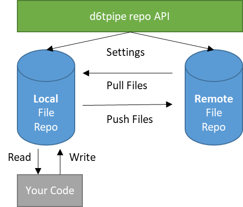

# Databolt Pipeline

d6tpipe is a python library which makes it easier to exchange data files. It's like git for data! But better because you can include it in your data science code.

## Why use d6tpipe?

Sharing data files is common, for example between data vendors and consumers, data engineers and data scientists, teachers and students or desktop and laptop. 

But often the process is more cumbersome than you would like. With d6tpipe, in just a few lines of code, you can push and pull data files to/from a remote file store in a simple and unified framework. The recipient doesn't have to know where and how data is stored, the sender manages that on behalf of the recipient.

## What can d6tpipe do for you?

* Quickly create public and private remote file storage eg AWS S3 and ftp
	* Managed d6tpipe file storage which takes care of all AWS S3 settings and 1GB free storage
* Push/pull data to/from remote file storage to sync files and share with others
* Centrally manage data files across multiple projects
* Secure your data with permissions management and encrypting credentials
* Easily load and process files you have pulled

## How does it work?

It works similar to git: files are stored in a remote file storage and you pull files to your local machine. The d6tpipe repo API, which is a meta-database, stores the settings to pull and load data. Unlike git, local files are stored in a central file storage, easily accessible but separate from your code. As data files change, you pull/push files that have changed from/to remote storage.



Why not just use git for data too? Because git is designed for small text files not large data files, slower and less secure. It also good practice to separate data from code so you manage code with git and data with d6tpipe.

## Installation

Install with `pip install d6tpipe`. To update, run `pip install d6tpipe -U --no-deps`.

To install with ftp/sftp dependencies run `pip install d6tpipe[ftp]`.

You can also clone the repo and run `pip install .`

## First-time setup and registration

See https://d6tpipe.readthedocs.io/en/latest/quickstart.html#first-time-setup

## Example Usage

Below is an example for pulling and loading machine learning data from an S3 bucket. It can be done in just a few commands directly from your python code.

For full quickstart instructions including setup, see [Quickstart documentation](https://d6tpipe.readthedocs.io/en/latest/quickstart.html)

```python

import d6tpipe

d6tpipe.api.ConfigManager().init() # just once
api = d6tpipe.api.APIClient() # connect to repo API
api.register('your-username','your@email.com','password') # just once

# find interesting datasets
api.list_pipes()
# ['intro-stat-learning']

# pull files from a data pipe with just one command
pipe = d6tpipe.Pipe(api, 'intro-stat-learning')
pipe.pull() 

'''
pulling: 0.52MB
100%|██████████| 10/10 [00:01<00:00,  8.25it/s]
['Advertising.csv',
 'Auto.csv',
 ...
 'README.md']
############### README ###############
# An Introduction to Statistical Learning
http://www-bcf.usc.edu/~gareth/ISL/data.html
############### README ###############
'''

# read a file into pandas from central repo with correct settings

import pandas as pd
df = pd.read_csv(pipe.dirpath/'Advertising.csv', **pipe.readparams['pandas']) 
df.head(2)      
'''
      TV  radio  newspaper  sales
1  230.1   37.8       69.2   22.1
2   44.5   39.3       45.1   10.4
'''

```

## Documentation

http://d6tpipe.readthedocs.io

## Data Security

If you are using managed remotes files will be stored in a d6tpipe AWS S3 bucket where permissions and credentials are managed on your behalf. Permissions are managed such that only you have access, unless you grant access to others. You can also self-host S3 and ftp which requires you or a vendor to set up and manage the remote file storage on your own.

See https://d6tpipe.readthedocs.io/en/latest/security.html

## d6tflow Integration

Getting files is often just the first part of a data science workflow. To help you with subsequent processing of data, we recommend you make use of [d6tflow](https://github.com/d6t/d6tflow). See [Sharing Workflows and Outputs](https://d6tflow.readthedocs.io/en/latest/collaborate.html).

## Accelerate Data Science

Check out other d6t libraries, including  
* manage data workflows: quickly build highly effective data science workflows
* import data: quickly ingest messy raw CSV and XLS files to pandas, SQL and more
* join data: quickly combine multiple datasets using fuzzy joins

https://github.com/d6t/d6t-python

## Get notified

`d6tpipe` is in active development. Join the [databolt blog](http://blog.databolt.tech) for the latest announcements and tips+tricks.

## License and Terms

The client library is under MIT license. If you use managed resources, in particular managed remote file storage, see [Terms](https://www.databolt.tech/index-terms.html) and [Privacy](https://www.databolt.tech/index-terms.html#privacy).

## Collecting Errors Messages and Usage statistics

We have put a lot of effort into making this library useful to you. To help us make this library even better, it collects ANONYMOUS error messages and usage statistics. See [d6tcollect](https://github.com/d6t/d6tcollect) for details including how to disable collection. Collection is asynchronous and doesn't impact your code in any way.

It may not catch all errors so if you run into any problems or have any questions, please raise an issue on github.