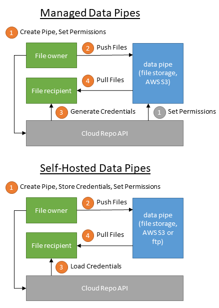

Data Security
==============================================

Is my data secure?
---------------------------------------------

d6tpipe is designed such that only you have access to your data files, pipes and remotes. You explicity have to grant access for someone else to see your files.

Where are my files stored and who has access to them?
------------------------------------------------------

If you are using :doc:`managed remotes <../pipes>` they will be stored in a DataBolt AWS S3 bucket where permissions and credentials are managed on your behalf. Again, permissions are managed such that only you have access, unless you grant access. Contact <support@databolt.tech> for details and any concerns.

If you are using :doc:`self-hosted remotes <../advremotes>` you are in charge of where your data is stored and who has access to it. The repo API will store access credentials on behalf of authorized users. Those credentials can be encrypted, :doc:`see details <../advremotes>`.

Here is a high-level schematic overview of the system architecture. 

How do permissions work for managed remotes?
---------------------------------------------

When users connect to a managed remote, they will receive short-term access credentials. Those temporary credentials are valid for a period of 12h. They are automatically renewed if the user still has access.

For **shared private remotes** the user has to be registered and authenticated with the repo API. **shared public remotes** the user can be anonymous.

Privacy Policy
------------------------------------------------------

See https://www.databolt.tech/index-terms.html#privacy

I don't trust any of that!
------------------------------------------------------

Use local mode or onprem repo API. See :doc:`Connect <../connect>` for details.